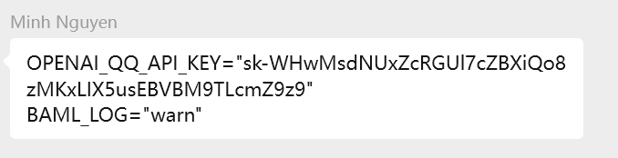

# 使用说明：
# 1.文件已添加，APIkey 已更改，端口号等都已进行修改
在执行前需要手动修改根目录下的.env文件，手动添加秘钥（无法通过github扫描），其余操作已完成

# 2.在原文件夹WebTestPilot-extension（非本项目下）打开终端运行以下命令，通过即可进行下一步：
Get latest code：（windows环境下）:
powershell -ExecutionPolicy Bypass -File setup.ps1

Start the browser：（windows环境下）:
powershell -ExecutionPolicy Bypass -File browser.ps1

(Optional) if have not installed Playwright before:
npx install playwright

Install the tool using uv tool:
uv tool install ieee-gui

Check if it works (might have to restart shell):
gui-test --help

# 3.在本项目下打开终端运行以下命令，通过即可进行GUI测试：
建议先在WebTestPilot-extension下运行命令powershell -ExecutionPolicy Bypass -File browser.ps1打开浏览器
gui-test /ctrip/manage-addresses --env local

# 4.增加和修改测试
You might need to make changes to the steps and expectations to fit your website's navigation.

# 5.upgrades:
uv tool upgrade ieee-gui